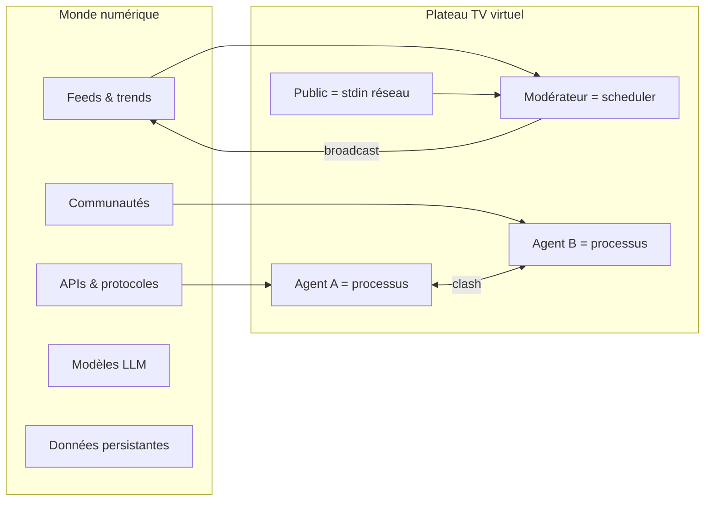

# Itération 2 — Métaphore « monde dans l'ordi »

**Date :** 2026-07-14  
**Input :** revue de l'itération 1 + recherche conceptuelle

---

## Affinage de la question philosophique

Le monde « dans l'ordinateur » n'est pas une copie du monde physique. C'est un **écosystème de flux** :

### Définition itération 2

| Concept physique | Équivalent numérique | Dans VTV aujourd'hui |
|------------------|----------------------|----------------------|
| Studio TV | Process sandbox isolé | ✅ app locale |
| Caméra | Vue sur l'état (`ShowState`) | ⚠️ texte seulement |
| Régisseur | Orchestrateur LangGraph | ✅ `show_graph.py` |
| Invité | Agent avec persona + mind | ✅ `PersonaVector` |
| Oreillette | File thread-safe | ✅ `submit_earpiece` |
| Téléspectateur | Utilisateur humain | ✅ mode spectateur |
| Antenne | Stream / publication | ❌ absent |
| Mémoire culturelle | Checkpoints / RAG | ❌ absent |

**Les agents ne sont pas des humains simulés.** Ce sont des **processus interprétatifs** — chacun optimise une fonction (convaincre, nuancer, provoquer) sur un bus d'événements partagé (`ShowState`). Leur « corps » est leur **topologie cognitive** ; leur « voix » devrait être leur **latence + prosodie** ; leur « réputation » serait leur `stance_history` persistée.

---

## Reclassement des 10 options (v2)

Critères ajoutés : **alignement métaphore** (40%), **réutilisation codebase** (30%), **effet wow** (30%).

| Rang | Option | Δ | Justification |
|------|--------|---|---------------|
| 1 | **Le Conclave Numérique** | ↑ | Oreillette = injection de paquets ; coulisses = `/proc` du débat ; tension = charge CPU émotionnelle |
| 2 | **VTV Spectateur Vivant** | ↑ | Chemin le plus court vers « vivant » : TTS + jauges + sons studio |
| 3 | **Plateau Minimaliste Cognitif** | ↑↑ | Les coulisses existent déjà — révéler le mind state comme UX principale = différenciation |
| 4 | **La Régie Invisible** | — | Mode régie déjà amorcé (`regieVisible`) |
| 5 | **Symposium Distribué** | ↓ | Gros refactor infra ; éloigne du desktop PyQt |
| 6 | **Arène Multi-LLM** | — | Intéressant mais secondaire vs embodiment |
| 7 | **Émission Autonome 24/7** | ↓ | Nécessite infra stream ; dilue l'identité |
| 8 | **Studio Pédagogique** | — | Marché niche |
| 9 | **Pipeline Showrunner** | ↓ | Vidéo générative = autre produit |
| 10 | **Widget Embed** | — | Commoditise sans âme |

---

## Idée émergente : « V.TV = /dev/show0 »

Nommer le produit comme un **périphérique** : le plateau est le fichier spécial où le monde numérique se regarde penser. Tagline : *« Le monde se débat en direct. »*

---

## Review itération 2

**Amélioration :** métaphore cohérente, lien direct avec `ShowState` et oreillette.  
**Manque :** pas encore de spec design concrète ni de parcours spectateur minute par minute.  
**Next :** parcours UX + design system « studio numérique ».
