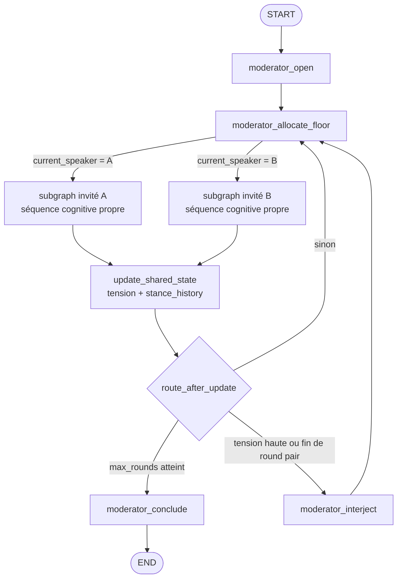

# Moteur de show TV à personas agentiques — Design

Date : 2026-07-02
Statut : implémenté (`src/show/`)

## 1. Objectif

Simuler un débat TV où chaque invité est une *personne* — personnalité × domaine ×
spécialisation — dont la **manière de penser est une topologie LangGraph**, et où tous
les agents (modérateur + 2 invités) lisent/écrivent un **état partagé** (`ShowState`).
On observe l'évolution du débat : dérive des opinions (`stance_history`), tension du
plateau, concessions, monologues intérieurs.

Le moteur est **headless** : CLI + export JSON. L'UI QML existante n'est pas touchée ;
`src/agents/` et `backend_bridge.py` restent intacts.

## 2. Architecture générale



Chaque invité est un **sous-graphe compilé dynamiquement** à partir de sa
`cognitive_sequence` et ajouté comme nœud du graphe show (pattern subgraph LangGraph,
même `state_schema` + même `context_schema`, le contexte runtime se propage).

## 3. Modules

| Module | Rôle |
| --- | --- |
| `show/personas/vector.py` | Schéma `PersonaVector` (dataclass frozen) + `validate()` |
| `show/personas/registry.py` | Matrice `PERSONALITIES` (3) × `DOMAINS` (5), `make_guest()`, `MODERATOR_PERSONA` |
| `show/state.py` | `ShowState` / `MindState` / `TranscriptEntry`, état initial |
| `show/mind.py` | Algorithmes purs : révision de croyance, appraisal émotionnel, tension |
| `show/llm.py` | Façade LLM (`think`, `search`) — point de mock unique pour les tests |
| `show/context.py` | `ShowContext` (client OpenAI, modèles, emit d'événements) |
| `show/nodes/` | `NODE_REGISTRY` : factories de nœuds cognitifs + `voice`/`deliver` |
| `show/graph/guest_subgraph.py` | Compile la séquence cognitive en sous-graphe |
| `show/graph/show_graph.py` | Orchestrateur : nœuds modérateur, routage, sous-graphes |
| `show/runner.py` | CLI headless, événements, transcript coloré, export JSON |
| `config/show_config.py` | Constantes (DRIFT_LR, seuils, budgets tokens, modèles) |

## 4. PersonaVector — une personne, pas une position

```python
@dataclass(frozen=True)
class PersonaVector:
    # identité
    name: str; agent_id: str
    personality: str            # clé PERSONALITIES
    domain: str                 # clé DOMAINS
    specialization: str         # texte libre : "physique quantique"
    # cognition — structure du graphe !
    cognitive_sequence: tuple[str, ...]
    evidence_style: str         # empirical | precedent | dialectic | narrative | formal
    # caractère — modulation des prompts et des algorithmes
    affective_baseline: float   # valence de départ [-1, 1]
    arousal_gain: float         # réactivité émotionnelle [0, 1]
    tactics: tuple[str, ...]    # sous-ensemble de SHOW_TACTICS
    concession_rate: float      # probabilité de concéder spontanément [0, 1]
    stubbornness: float         # résistance à la persuasion [0, 1]
    opener: str; sentence_max: int
    temperature_facts: float; temperature_voice: float
    forbidden: tuple[str, ...]
    # opinion initiale sur le sujet
    initial_stance: float       # [-1, 1]
    initial_conviction: float   # [0, 1]
```

`validate(vector)` lève `ValueError` sur toute incohérence (bornes, tactique inconnue,
séquence vide, nœud inconnu). **Aucun fallback silencieux** (contrairement à
`get_persona_vector` de l'ancien pipeline).

### Matrice personnalité × domaine

La **personnalité** pilote le caractère : `arousal_gain`, `tactics`, `concession_rate`,
`stubbornness`, `temperature_voice`, `opener`.

| Personnalité | Traits saillants |
| --- | --- |
| `provocateur` | arousal_gain 0.8, stubbornness 0.9, tactics clash/expose_hypocrisy/moral_attack |
| `diplomate` | concession_rate 0.35, tactics concede_then_refute/pivot/dismiss_fear |
| `cerebral` | temperature_voice 0.9, tactics contradiction/reframe/pivot_future |

Le **domaine** pilote la cognition : `cognitive_sequence`, `evidence_style`, lexique.
C'est la traduction « manière de penser → nœuds/edges » :

| Domaine | Style | Séquence cognitive |
| --- | --- | --- |
| `physicien` | empirical | listen → verify_facts → hypothesize → strategize → draft |
| `historien` | precedent | listen → recall_precedent → build_analogy → strategize → draft |
| `philosophe` | dialectic | listen → reframe_concept → find_contradiction → strategize → draft |
| `ecrivain` | narrative | listen → recall_anecdote → narrative_frame → strategize → draft |
| `economiste` | formal | listen → quantify → model_tradeoff → strategize → draft |

`make_guest(personality, domain, specialization, stance, ...)` fusionne les deux dicts,
valide et lève sur clé inconnue. Le builder ajoute ensuite `voice → deliver` (mise en
voix + antenne) et la branche conditionnelle de concession.

Le **modérateur** a lui aussi son vecteur (`MODERATOR_PERSONA` : style, seuil de
tension d'interjection `interject_threshold`) — une seule source de vérité.

## 5. ShowState — l'état partagé

```python
class TranscriptEntry(TypedDict):
    round: int; speaker: str; role: str       # guest | moderator
    text: str; tactic: str; evidence_used: bool

class MindState(TypedDict):
    stance: float; conviction: float          # opinion courante
    valence: float; arousal: float            # état émotionnel
    beliefs: list[str]                        # faits acceptés (mémoire)
    grudges: list[str]                        # attaques subies non répondues
    inner_monologue: str                      # pensée privée du dernier tour

class ShowState(TypedDict):
    topic: str; round: int; max_rounds: int; turn_index: int
    transcript: Annotated[list[TranscriptEntry], operator.add]   # reducer append
    current_speaker: str
    minds: dict[str, MindState]               # état privé par agent_id
    tension: float                            # température du plateau [0, 1]
    stance_history: dict[str, list[float]]    # évolution par tour
    moderator_notes: list[str]
    turn: dict                                # scratch du tour courant
```

Contrat de lecture/écriture :

- Les invités lisent le `transcript` (positions publiques) et n'écrivent que
  `minds[leur_id]` + `turn` + une entrée de transcript.
- Le modérateur lit `tension`, `stance_history`, le transcript ; écrit
  `current_speaker`, `moderator_notes`, transcript.
- `update_shared_state` (nœud moteur, pas un agent) recalcule `tension`, historise
  les stances, applique la décroissance émotionnelle en fin de round.

## 6. Algorithmes de conscience agentique (`show/mind.py`)

Fonctions **pures** (testables sans LLM) ; le score de persuasion est produit par un
juge LLM nano dans le nœud `listen`, puis injecté.

### 6.1 Révision de croyance (dérive d'opinion)

```
revise_stance(mind, persona, opponent_stance, persuasion):
    gap      = opponent_stance - mind.stance
    openness = (1 - stubbornness) * (1 - conviction)
    delta    = persuasion * openness * DRIFT_LR          # DRIFT_LR = 0.15
    mind.stance     = clamp(stance + sign(gap) * min(delta, |gap|), -1, 1)

update_conviction(mind, persuasion, countered):
    mind.conviction = clamp(conviction + (+0.05 si countered
                                          sinon -0.05 * persuasion), 0.1, 1.0)

should_concede(persuasion, persona, rand):
    return persuasion > CONCEDE_THRESHOLD or rand < concession_rate
```

`must_concede` est stocké dans `turn` et consommé par la branche conditionnelle après
`strategize` → nœud `concede_then_refute`. `concession_rate` est donc un
**comportement structurel** (branche du graphe), pas un chiffre décoratif.

### 6.2 Appraisal émotionnel (valence / arousal)

```
appraise(mind, persona, event):
    event == "attacked_personal" | "attacked_moral":
        arousal += arousal_gain * 0.3 ; valence -= 0.2
    event == "conceded_to_me":  valence += 0.3 ; arousal -= 0.1
    event == "argument":        arousal += arousal_gain * 0.1
    clamp arousal [0,1], valence [-1,1]

decay(mind):                 # fin de round
    arousal *= AROUSAL_DECAY          # 0.85
    valence += (baseline - valence) * 0.2

Effets en aval :
    temperature_voice_effective = temperature_voice + 0.4 * arousal
    arousal > 0.75 → tactiques agressives priorisées, sentence_max - 1
```

### 6.3 Monologue intérieur

À chaque tour, dans `deliver`, un appel nano produit 2 phrases de pensée privée
(ce que l'agent croit vraiment / ce qu'il cache), stockées dans
`MindState.inner_monologue` et émises comme événement `inner_monologue` — jamais
« à l'antenne ».

### 6.4 Tension du plateau

```
compute_tension(minds, last_round_entries):
    attack_density = |entrées invité avec tactique agressive| / max(1, |entrées invité|)
    return clamp(0.6 * mean(arousal) + 0.4 * attack_density, 0, 1)
```

## 7. Sous-graphe invité — la pensée en nœuds/edges

```python
def build_guest_subgraph(persona):
    g = StateGraph(ShowState, context_schema=ShowContext)
    seq = persona.cognitive_sequence
    for name in seq: g.add_node(name, NODE_REGISTRY[name](persona))
    g.add_node("concede_then_refute", NODE_REGISTRY["concede_then_refute"](persona))
    g.add_node("draft",   NODE_REGISTRY["draft"](persona))
    g.add_node("voice",   NODE_REGISTRY["voice"](persona))
    g.add_node("deliver", NODE_REGISTRY["deliver"](persona))
    g.add_edge(START, seq[0])
    for a, b in pairwise(seq): g.add_edge(a, b)
    # branche de caractère : concéder avant de contre-attaquer
    g.add_conditional_edges(seq[-1], route_concession,
        {"concede_then_refute": "concede_then_refute", "draft": "draft"})
    g.add_edge("concede_then_refute", "draft")
    g.add_edge("draft", "voice"); g.add_edge("voice", "deliver")
    g.add_edge("deliver", END)
    return g.compile()
```

Nœuds du registre (factories `persona -> node_fn(state, runtime)`) :

- `listen` : parse la dernière réplique adverse (CLAIM / WEAKNESS / ATTACK / SCORE via
  juge nano), applique révision de croyance + appraisal, décide `must_concede`.
- Nœuds **preuve** (`verify_facts`, `recall_precedent`, `quantify`) : requête web typée
  par `evidence_style` via `execute_search_web` existant (le physicien cherche des
  stats 2025, l'historien des précédents, l'économiste des chiffres macro).
- Nœuds **pensée** (`hypothesize`, `build_analogy`, `reframe_concept`,
  `find_contradiction`, `recall_anecdote`, `narrative_frame`, `model_tradeoff`) :
  LLM interne, produisent `turn["angle"]` chacun selon sa logique de domaine.
- `strategize` : choisit la tactique dans `persona.tactics` (modulée par arousal).
- `concede_then_refute` : rédige la concession, force la tactique éponyme.
- `draft` → `voice` → `deliver` : brouillon factuel (temperature_facts) → voix
  personnage (temperature effective) → réplique antenne (sentence_max) + entrée
  transcript + monologue intérieur + événements.

## 8. Orchestrateur (`show/graph/show_graph.py`)

Nœuds modérateur (prompts dérivés de `MODERATOR_PERSONA`) :

- `moderator_open` : introduction du sujet.
- `moderator_allocate_floor` : alterne A/B, annonce le passage de parole,
  incrémente `turn_index`, calcule `round = turn_index // 2 + 1`.
- `moderator_interject` : lit tension + 2 dernières répliques, relance/synthèse.
- `moderator_conclude` : lit `stance_history` et produit un vrai bilan
  (« X est passé de -0.8 à -0.5 »).

Routage :

```
route_after_update(state):
    si round > max_rounds:                        return "moderator_conclude"
    si fin de round ET (tension > interject_threshold OU round pair):
                                                  return "moderator_interject"
    sinon:                                        return "moderator_allocate_floor"
```

## 9. Runner CLI

```
python -m show.runner --topic "..." \
    --guest-a "provocateur:physicien:physique quantique:+0.8" \
    --guest-b "diplomate:philosophe:éthique des techniques:-0.6" \
    --rounds 5 --out result.json
```

Événements typés émis via `ShowContext.emit` : `moderator`, `turn`,
`inner_monologue`, `stance_update`, `step`. Le runner les rend en transcript coloré
(stdout) + tableau final d'évolution des stances, et exporte le `ShowState` final en
JSON (contrat futur pour l'UI QML).

## 10. Tests

- `test_show_registry.py` : 15 combinaisons valides, erreurs sur clés inconnues,
  séquences distinctes par domaine, validation des bornes.
- `test_show_mind.py` : direction et clamps de la dérive, immobilisme du têtu,
  appraisal, décroissance, tension, déclenchement de concession (pur, rand injecté).
- `test_show_topology.py` : les 5 sous-graphes compilent, topologies distinctes
  (nœuds attendus présents), show graph compile.
- `test_show_smoke.py` : LLM mocké (`show.llm.think` / `show.llm.search`), 1 round
  complet, transcript et stance_history cohérents.

## 11. Hors périmètre

- Pas de modification de `src/agents/`, `backend_bridge.py`, UI QML.
- Pas de checkpointer/persistance LangGraph, pas d'interruptions intra-tour.
- 3 personnalités × 5 domaines fixes ; extension par données dans le registre.
